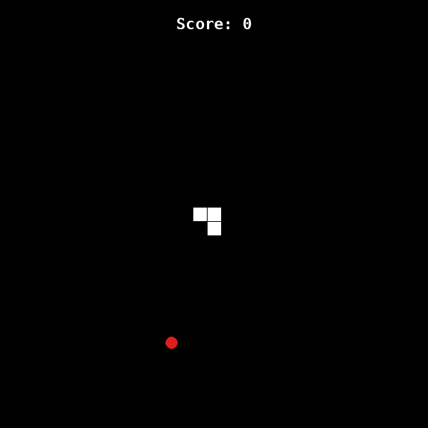

# 🐍 Snake Game

A classic Snake game built with Python's built-in `turtle` graphics module — no external dependencies required.



## Features

- Smooth snake movement with arrow-key controls
- Snake grows one segment every time it eats food
- Random food spawning across the board
- Live scoreboard
- Wall and self-collision detection with a "Game Over" screen

## How to Run

```bash
git clone https://github.com/akshay9-ops/snake-game.git
cd snake-game
python3 main.py
```

Requires Python 3 with `turtle` (included in the standard library on most installs).

## Controls

| Key | Action |
|-----|--------|
| ↑ | Move up |
| ↓ | Move down |
| ← | Move left |
| → | Move right |

## Project Structure

```
snake-game/
├── main.py         # Game loop, screen setup, controls, collision detection
├── snake.py        # Snake class — movement, growth, direction
├── food.py         # Food class — random spawning
├── scoreboard.py   # Scoreboard class — score tracking and game over message
└── demo.gif
```

## Tech Stack

Python 3 · turtle

## Author

Built by [Ak](https://github.com/akshay9-ops)
